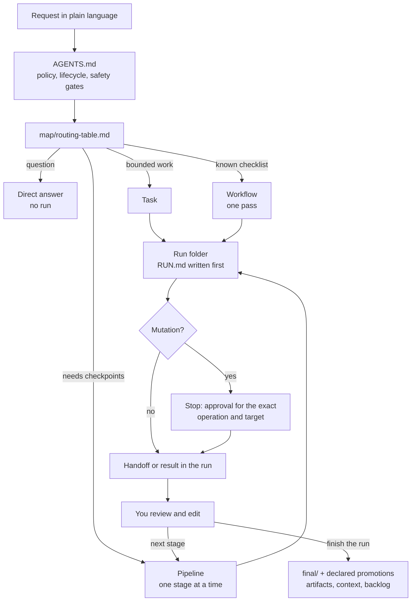

# ICM DevOps Workspace

*A tool-agnostic, filesystem-based control layer for AI agents.*

**An AI agent's plans, progress, and knowledge shouldn't live in a chat window or inside one tool. In this workspace they are kept as plain, version-controlled files alongside the work itself, so any task can be paused and resumed days later, reviewed by a colleague, or handed to a different agent/tool/harness in the middle of a run without losing its context or its history.**

> **The idea is as old as the Unix pipeline:** small stages that each do one job, read text in, and write text out, a design that has held up for more than fifty years. **Interpretable Context Methodology (ICM)**, by Jake Van Clief and David McDermott, applies it to AI agents. The workflow is the folder structure: instructions and context are plain Markdown, and a single agent does the work by reading the right files at each step. Unlike a pipe, every handoff is a file that a person can read, edit, and review before the next stage runs.

This kit applies ICM to DevOps work: building, delivering, and operating infrastructure and services. Routing, stage contracts, reference context, run state, and safety gates all live as Markdown in the workspace the agent works in, so there is no framework to install and nothing hidden from review.

It scales from one operator to a team: the kit and the knowledge it accumulates are shared through a repository, while each operator's runs stay private. The promoted context and artifacts work as a shared knowledge base in the spirit of an [LLM wiki](https://gist.github.com/karpathy/442a6bf555914893e9891c11519de94f), and they stay manageable with many contributors because only small, reviewed promotions reach the shared repository. See [Using the kit as a team](docs/team-use.md).

## ICM, applied to DevOps

The [ICM paper](https://arxiv.org/abs/2603.16021) argues that for sequential work with human review between steps, multi-agent frameworks add more complexity than the problem needs. This kit keeps its principles:

| ICM principle | In this kit |
|---|---|
| **The filesystem is the architecture.** Folders encode order; Markdown carries each step's role and context. | `AGENTS.md`, the routing table, workflows, and pipeline contracts are plain Markdown. There is no orchestration code to deploy or debug. |
| **Layered context loading**, "prevention rather than compression". | Every route and stage names its exact input files. A Kubernetes review never loads your AWS notes. In the paper's example, each stage loads about 5,000 tokens, while a single context holding every stage's material exceeds 40,000. |
| **Every output is an edit surface.** | Each pipeline stage writes a handoff and stops. You can edit it, and the next stage reads your version. |
| **Plain text as the interface.** | Any agent that reads files can run the workspace; any workspace can be diffed and kept in Git. |
| **Configure the factory, not the product.** | Reference context is set up once and reused by every run; only the run's working material changes. |

On top of that, DevOps work needs things a single content pipeline does not:

- **One workspace, many processes.** A routing table sends each request to a direct answer, a task, a one-pass workflow, or a staged pipeline, from onboarding a new service and writing its Helm chart to rolling out a release or responding to an incident.
- **Persistent runs.** Every unit of work gets a folder with its plan, handoffs, and results that outlives the session.
- **Safety gates.** Mutating operations stop for explicit approval in every process, including urgent incident work. ICM itself does not address permissions.
- **A feedback loop into stable context.** Reviewed facts from finished runs become project context with a `Last verified` date, so later runs start from them.

This is an adaptation, not an official ICM implementation. [`docs/concepts/icm-alignment.md`](docs/concepts/icm-alignment.md) maps what is kept, what is added, and where terminology differs. Primary sources: the [paper (arXiv:2603.16021)](https://arxiv.org/abs/2603.16021) and the [reference implementation](https://github.com/RinDig/Interpretable-Context-Methodology).

## How it works



### Four ways a request is handled

| | Used for | Run folder | Example |
|---|---|---|---|
| **Direct answer** | Questions, status checks, clarification | No | "Which state backend does this module use?" |
| **Task** | Bounded work with no reusable procedure | Yes | "Rename these variables across the module" |
| **Workflow** | Recurring work with a known checklist, done in one pass | Yes | "Review the Terraform change in `repos/network-infra/`" |
| **Pipeline** | Work where a person should check intermediate results | Yes, one handoff per stage | "Plan moving the orders database to the new subnet group" |

### Context layers

| Layer | What | Where |
|---|---|---|
| 0 | Policy | `AGENTS.md` |
| 1 | Routing | `map/routing-table.md` and one route file, or a pipeline's `PIPELINE.md` |
| 2 | The active contract | one workflow file, or one stage contract |
| 3 | Reference material, named per stage | `context/reference/`, `context/project/`, reused workflows |
| 4 | Working material for this run | the run's `input/`, earlier handoffs, `artifacts/` |

## Repository layout

```text
icm-devops-workspace/
├── template/          what gets copied into your workspace: AGENTS.md, repos/, _workspace/
├── scripts/
│   ├── init-workspace.py   copy the template into a folder; never overwrites without --overwrite
│   └── validate-kit.py     check every path, route, and stage contract in the kit
├── docs/              the model, authoring guides, safety and lifecycle, team use
├── examples/          three request traces, end to end
├── ARCHITECTURE.md    ownership boundaries and contracts of this repository
└── CHANGELOG.md, VERSION, LICENSE
```

## Workspace structure

An initialized workspace is a folder of its own. Code lives under it in `repos/`, never the other way round, so no code repository has to know about the workspace.

```text
ops-workspace/
├── AGENTS.md                         policy, run lifecycle, safety gates; read first on every request
├── repos/<name>/                     code repositories, one checkout each; excluded from the workspace's Git
└── _workspace/
    ├── map/
    │   ├── routing-table.md          maps a request to an answer, task, workflow, or pipeline
    │   ├── routes/<domain>.md        per-domain workflow routes, opened only when they match
    │   ├── workspace-map.md          what lives where, including each repository
    │   └── naming-conventions.md     names for runs and promoted files
    ├── workflows/<group>/<name>.md   one-pass procedures: required context, process, result
    ├── pipelines/<name>/
    │   ├── PIPELINE.md               stage routing, layers, route boundary, operating rules
    │   └── stages/NN_<name>/<name>.md  stage contract: inputs, do-not-load, process, audit, artifacts, gate
    ├── context/
    │   ├── reference/                shipped principles, checklists, provider notes, tool notes, your own conventions
    │   └── project/                  reviewed facts and procedures for your systems, each with a Last verified date
    ├── runs/
    │   ├── active/<date>-<slug>/     one unit of work
    │   │   ├── RUN.md                request, assumptions, plan, current step, promoted paths
    │   │   ├── input/                material you supplied
    │   │   ├── stages/NN_<name>.md   pipeline handoffs, each reviewed before the next stage
    │   │   ├── artifacts/            working material and deliverables under review
    │   │   └── final/                approved content, written only on explicit finish
    │   └── archive/                  finished runs, moved whole on explicit instruction
    ├── artifacts/<family>/           promoted documents others need after a run
    └── backlog/items/                deferred follow-ups, risks, and open actions
```

## Example: incident response

Request: *"Checkout is returning 5xx since 14:10."*

1. The routing table matches active incident impact and selects `pipelines/incident-response/`. The agent creates `runs/active/2026-10-02-checkout-5xx/` and writes `RUN.md`.
2. **00 Triage:** impact, severity, timeline, facts, and hypotheses from read-only checks. It writes `stages/00_triage.md` and stops.
3. **01 Stabilize:** compares candidate mitigations, then requests approval for the exact action and target before executing. Incident urgency does not bypass the gate.
4. **02–05:** investigate, recover, verify, and communicate, each with its own handoff and review gate.
5. **06 Finalize:** produces the response record. On finish, the pipeline's declared promotions apply: a sanitized incident note goes to `artifacts/incident-notes/` and open actions to `backlog/items/`. The run is archived intact.

[`examples/`](examples/) traces a one-pass workflow, a pipeline that reuses workflows, and a stage-owned pipeline.

## What ships

| | |
|---|---|
| Pipelines | 20 |
| Workflows | 37 |
| Reference context | 11 principle and checklist files, 4 provider notes, 8 tool notes |
| Scripts | 2, Python standard library only |

They cover building (onboarding a new service, Dockerfiles, Helm charts, Kustomize overlays, CI pipelines, GitOps applications, Terraform modules, alerts), changing and rolling out, operating and troubleshooting, and recovering systems. Browse `template/_workspace/` for the full list.

## Quick start

```sh
git clone <this repository>
cd icm-devops-workspace
mkdir -p ~/ops-workspace
python3 scripts/init-workspace.py ~/ops-workspace
git clone <your-repository> ~/ops-workspace/repos/<name>
```

Then point your agent at `~/ops-workspace` and ask in plain language. The script leaves existing files untouched unless `--overwrite` is given, and it does not initialize Git or register the workspace anywhere. [`docs/getting-started.md`](docs/getting-started.md) walks through the first session.

## Making it yours

The shipped rules and processes are meant to stay the same across workspaces and improve over time. Workspace-specific needs go into places built for them:

- **Stricter safety rules:** add them under `## Additional safety gates` in `AGENTS.md`.
- **Extra inputs or rules for one workflow or stage:** append `## Additional instructions` to that file. It can add inputs and stricter rules, never relax the contract. See [authoring pipelines](docs/authoring/pipelines.md#additional-instructions).
- **Your own conventions and checklists:** put them in `context/reference/` and name them in the stages that need them.
- **Extra context for a single step:** name it while the stage runs. The agent loads it and records it in the handoff.
- **New workflows and pipelines:** copy the closest existing one; see [authoring workflows](docs/authoring/workflows.md) and [authoring pipelines](docs/authoring/pipelines.md).
- **Teams:** share the kit and the promoted knowledge through a repository and keep each operator's runs private. See [using the kit as a team](docs/team-use.md).

## When not to use it

- **Tight real-time loops between agents.** ICM's file-based handoffs are too slow for agents that must react to each other continuously.
- **High-concurrency automation.** A workspace is local and human-paced; it is not a job queue.
- **Branching decided by the model mid-pipeline.** Stages are linear, and a person decides between them.

The safety gates are instructions the agent follows, not an access-control system. Pair them with real controls: least-privilege credentials, protected branches, and approval rules in your CI/CD and cloud accounts.

## Documentation

- [Getting started](docs/getting-started.md)
- [Methodology](docs/concepts/methodology.md)
- [Context model](docs/concepts/context-model.md)
- [Relationship to ICM](docs/concepts/icm-alignment.md)
- [Using the kit as a team](docs/team-use.md)
- [Authoring workflows](docs/authoring/workflows.md)
- [Authoring pipelines](docs/authoring/pipelines.md)
- [Safety and lifecycle](docs/authoring/safety-and-lifecycle.md)

## Credits

Built on **Interpretable Context Methodology** by Jake Van Clief and David McDermott: Van Clief, J. and McDermott, D., *Interpretable Context Methodology: Folder Structure as Agentic Architecture*, arXiv:2603.16021, 2026. Reference implementation: <https://github.com/RinDig/Interpretable-Context-Methodology>.

## License

[CC0 1.0 Universal](LICENSE).
